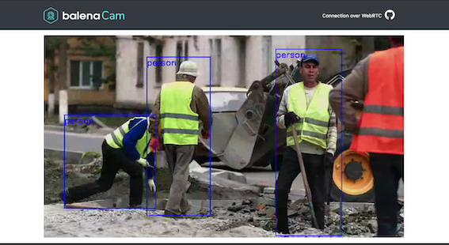

# WebRTC Streaming Object Detector with Coral.ai and BalenaCloud

This guide will help you deploy a webRTC streaming camera feed with realtime people detection using the [Coral.ai TPU][coral] enabled devices. It will work on the official [Coral.ai dev board][coral-dev].



Table of Contents:
- [Set up a fleet (probably of 1 at first) of Coral TPU enabled devices](#setup-a-fleet-of-devices)
- [Deploy the demo code to your fleet remotely](#deploy-the-demo-code)
- [Configure your input feed](#configure-input-feed)
- [Remotely change or update the AI model your fleet uses](update-your-model)

## Setup a fleet of devices

In balenaCloud code is deployed to groups of devices called "applications". To deploy code to your device(s) remotely you need to first [sign up for an account on balenaCloud](https://dashboard.balena-cloud.com/signup). Once you are signed in, create a new application and call it something like `edge-ai`.

You now are ready to add devices to your fleet. To get a device online and connected to balenaCloud, complete the ["Add your first device"][add-new-device-coral] and ["Provision Device"][provision-device-coral] steps of the [Getting Started Guide][getting-started-balena] for your specific device.

When your device is provisioned, you should have something that looks like the below:


## Deploy the demo code

Now let's deploy some code. Make sure you have the [balena CLI][balena-cli] installed and open up your favorite console terminal. In the console, make sure you are logged into your balenaCloud account.
```
$ balena login
```
Grab the code from this repository either by git cloning or downloading the zip and navigate to the root of this newly downloaded repo. From within the root of the project we can now deploy our code using the following:
```
$ balena push <MY_APP_NAME>
```
replacing `<MY_APP_NAME>` with the name you selected when you created your application in step 1. With this single command, the balena CLI will initiate a build on the cloud for the correct architecture and every device in your fleet will start running this code. Once the code is deployed you should see some device log output like the following, and if you navigate to the devices IP address or [balenaCloud public Device URL][public-url] you should be served a website with your video stream and blue rectangles will indicate the detected objects:
```
[Logs]    [6/22/2020, 5:23:24 PM] [edge-logic] INFO:root:#############################################################
[Logs]    [6/22/2020, 5:23:24 PM] [edge-logic] INFO:root:Authorization is disabled.
[Logs]    [6/22/2020, 5:23:24 PM] [edge-logic] INFO:root:Anyone can access your balenaCam, using the device's URL!
[Logs]    [6/22/2020, 5:23:24 PM] [edge-logic] INFO:root:Set the username and password environment variables to enable authorization.
[Logs]    [6/22/2020, 5:23:24 PM] [edge-logic] INFO:root:For more info visit: https://github.com/balena-io-playground/balena-cam
[Logs]    [6/22/2020, 5:23:24 PM] [edge-logic] INFO:root:#############################################################
[Logs]    [6/22/2020, 5:23:24 PM] [edge-logic] 
[Logs]    [6/22/2020, 5:23:24 PM] [edge-logic] ======== Running on http://0.0.0.0:80 ========
[Logs]    [6/22/2020, 5:23:24 PM] [edge-logic] (Press CTRL+C to quit)
```

## Configure Input Feed

This demo can either stream from a video file or from a camera device. By default the demo will stream from the MP4 video file at [edge-logic/video/construction.mp4](edge-logic/video/construction.mp4). To configure webcam streaming simply define an Environment Variable called `CAMERA` either from the [balenaCloud Dashboard](https://www.balena.io/docs/learn/manage/serv-vars/#device-environment-and-service-variables) or add `ENV CAMERA=0`. By default the camera will use `/dev/video0` but if you have multiple cameras you can specify the `CAMERA` env var with the integer value of the video device, e.g.: `CAMERA = 3` would use `/dev/video3`.

## Update your model

Okay, so now we know how to deploy and update our code easily, but how do we update or change our model? In this project, you will notice that the code is split into `edge-logic` and `models`. These containers can be happily updated without affecting one another too much. If you want to deploy a new model to your fleet, simply drop your new model and its labels into the "models" folder and make sure to name them `model.tflite` and `labels.txt`. You can find some great premade models [here][coral-models]. Make sure to select one of the "classification" models for this demo.

With your new model added, perform another `balena push` to your application and you should see the `model` service update and begin running. Super easy!

## Additional Configuration

### Log Verbosity
It is possible to change the logging level of the python code by setting an environment variable called `LOGLEVEL`. By default it is set as `INFO` as described in [python3 Basic Logging Tutorial](https://docs.python.org/3/howto/logging.html#basic-logging-tutorial).

### Authenticated Login for Video Stream

To protect your balenaCam devices using a username and a password set the following environment variables.

| Key            | Value
|----------------|---------------------------
|**`username`**  | **`yourUserNameGoesHere`**
|**`password`**  | **`yourPasswordGoesHere`**

💡 **Tips:** 💡 
* You can set them as [fleet environment variables](https://www.balena.io/docs/learn/manage/serv-vars/#fleet-environment-and-service-variables) and every new balenaCam device you add will be password protected.
* You can set them as [device environment variables](https://www.balena.io/docs/learn/manage/serv-vars/#device-environment-and-service-variables) and the username and password will be different on each device.

[coral]:https://coral.ai
[coral-dev]:https://coral.ai/products/dev-board
[coral-usb]:https://coral.ai/products/accelerator/
[coral-models]:https://coral.ai/models/
[balena]:https://www.balena.io/
[getting-started-balena]:https://www.balena.io/docs/learn/getting-started
[public-url]:https://www.balena.io/docs/learn/manage/actions/#enable-public-device-url
[balena-devices]:https://www.balena.io/docs/reference/hardware/devices/
[add-new-device-coral]:https://www.balena.io/docs/learn/getting-started/coral-dev/python/#add-your-first-device
[balena-cli]:https://www.balena.io/docs/reference/balena-cli/
[provision-device-coral]:https://www.balena.io/docs/learn/getting-started/coral-dev/python/#provision-device