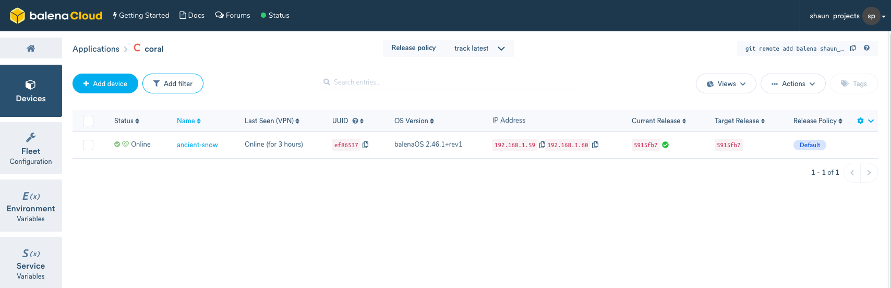

# Getting Started with Coral.ai on BalenaCloud

This guide will get you started with deploying code and models on a fleet [Coral.ai][coral] enabled devices. It will work on the official [Coral.ai dev board][coral-dev] or on any of the other [balenaCloud device types][balena-devices] connected to a [Coral.ai USB accelerator][coral-usb].

In this guide you will:
1. Set up a fleet (probably of 1 at first) of [Coral TPU][coral] enabled devices.
2. Deploy the demo code to your fleet remotely.
3. Remotely change or update the AI model your fleet uses.

## Setup a fleet of devices

In balenaCloud code is deployed to groups of devices called "applications". To deploy code to your device(s) remotely you need to first [sign up for an account on balenaCloud](https://dashboard.balena-cloud.com/signup). Once you are signed in, create a new application and call it something like `edge-ai`.

You now are ready to add devices to your fleet. To get a device online and connected to balenaCloud, complete the ["Add your first device"][add-new-device-coral] and ["Provision Device"][provision-device-coral] steps of the [Getting Started Guide][getting-started-balena] for your specific device.

When your device is provisioned, you should have something that looks like the below:



## Deploy the demo code

Now let's deploy some code. Make sure you have the [balena CLI][balena-cli] installed and open up your favorite console terminal. In the console, make sure you are logged into your balena account.
```
$ balena login
```
Grab the code from this repository either by git cloning or downloading the zip and navigate to the root of this newly downloaded repo. From with in the root of the project we can now deploy our code using the following:
```
$ balena push <MY_APP_NAME>
```
replacing `<MY_APP_NAME>` with the name you selected when you created you application in step 1. With this single command, the balena CLI will initiate a build on the cloud for the correct architecture and every device in you fleet will start running this code. Once the code is deployed you should see some device log output like the following, indicating successful inference of our parrot image:
```
21.04.20 09:48:06 (+0200)  model  Copying Model to shared volume...
21.04.20 09:48:06 (+0200)  model  'model.tflite' -> 'shared-model/model.tflite'
21.04.20 09:48:06 (+0200)  model  'labels.txt' -> 'shared-model/labels.txt'
21.04.20 09:48:08 (+0200) Service exited 'model sha256:ecc7c067ed40fe05a954d350f12c09eb8fe29a1603a41727db0ad3d303340e72'
21.04.20 09:48:10 (+0200)  edge-logic  ---------------------------
21.04.20 09:48:10 (+0200)  edge-logic  macaw
21.04.20 09:48:10 (+0200)  edge-logic  Score :  0.99609375
21.04.20 09:48:11 (+0200) Service exited 'edge-logic sha256:6c9cab0aa31683ce140d5c16a3d09681a73e6eca25b2a044d3b7f4b74bb560da'
```

## Update your model

Okay, so now we know how to deploy and update our code easily, but how do we update or change our model? In this project, you will notice that the code is split into `edge-logic` and `models`. These containers can be happily updated without affecting one another too much. If you want to deploy a new model to your fleet, simply drop your new model and its labels into the "models" folder and make sure to name them `model.tflite` and `labels.txt`. 

With your new model added, perform another `balena push` to your application and you should see the `model` service update and begin running. Super easy!

[coral]:https://coral.ai
[coral-dev]:https://coral.ai/products/dev-board
[coral-usb]:https://coral.ai/products/accelerator/
[coral-models]:https://coral.ai/models/
[balena]:https://www.balena.io/
[getting-started-balena]:https://www.balena.io/docs/learn/getting-started
[balena-devices]:https://www.balena.io/docs/reference/hardware/devices/
[add-new-device-coral]:https://www.balena.io/docs/learn/getting-started/coral-dev/python/#add-your-first-device
[balena-cli]:https://www.balena.io/docs/reference/balena-cli/
[provision-device-coral]:https://www.balena.io/docs/learn/getting-started/coral-dev/python/#provision-device

